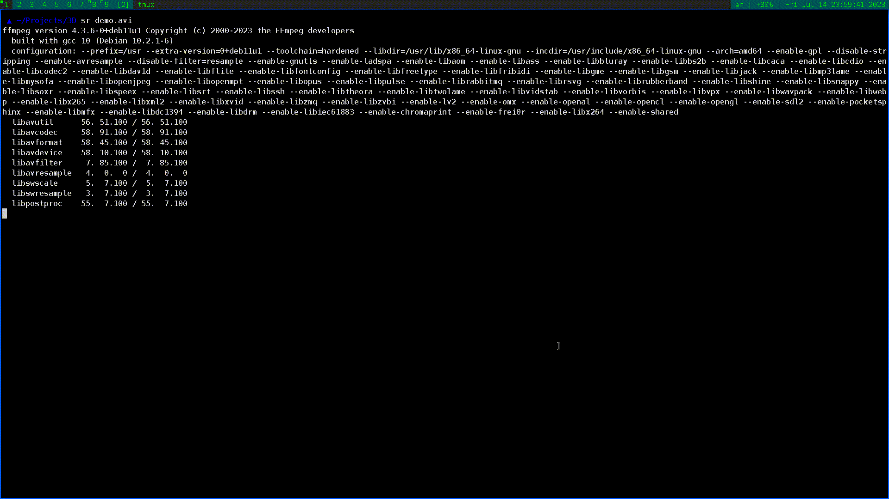

# Шахматный движок

## Oглавление:

* демо
* Сборка проекта
* Как пользоватся
* Как работает

## Демо:

## Сборка проекта:

1. Установите `g++`, `git`, `make` и `sfml`
2. Соберите проект

		git clone https://github.com/iv4n-t3a/3D
		cd 3D
		make

## Как пользоватся:

	./render

Чтобы поменять настройки поменяйте код файла `config.cpp` и перекомпилируйте проект

## Как работает:

Для отображения фигур здесь используется простая ортогональная проекция на экран,
для вращения используется домножение на матрицы поворота вокруг нескольких осей
